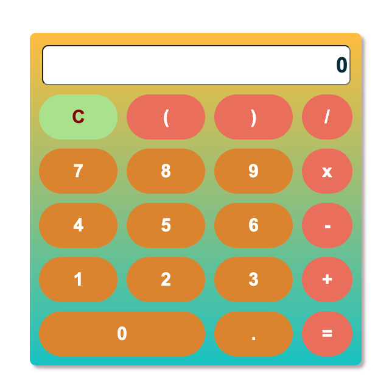

# Calculator App

This calculator are supported by 4 operations: addition, subtraction, multiplication, division. It also supports positive, negative, decimal numbers, and parentheses.



## Local Setup

```sh
$ git clone https://github.com/itzsarahhx3/calculator-app.git
```

```sh
$ cd calculator-app
```

```sh
$ npm install
```

## Run Locally (http://localhost:3000)

```sh
$ npm start
```
Press a to run all tests
```sh
$ a
```

## Run Tests

```sh
$ npm test
```

## Documentation

[Create React App documentation](https://facebook.github.io/create-react-app/docs/getting-started).
[React documentation](https://reactjs.org/).
